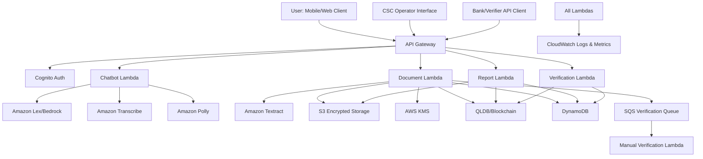

# Design Document: SchemeSetu AI

## Overview

SchemeSetu AI is a serverless, privacy-first trust wallet platform built on AWS infrastructure. The system enables informal workers to securely store documents, generate verifiable income reports, discover eligible government schemes, and build trust scores for micro-loan facilitation.

The architecture follows a microservices pattern with event-driven processing, leveraging AWS Lambda for compute, DynamoDB for data storage, S3 for document storage, QLDB for blockchain anchoring, and Amazon Lex/Bedrock for conversational AI. All components communicate through API Gateway with Cognito-based authentication.

Key design principles:
- **Privacy-first**: Only document hashes stored on blockchain, never raw content
- **Encryption everywhere**: KMS-encrypted storage, TLS in transit
- **Explicit consent**: User consent tracked with versioning and audit logs
- **Multilingual accessibility**: Hindi and English support with voice interface
- **Offline-capable**: Draft mode with automatic sync when online
- **Verifiable trust**: Blockchain-anchored reports with QR code verification

## Architecture

### High-Level Architecture



### Component Responsibilities

**API Gateway**: 
- Single entry point for all HTTP requests
- Request validation and throttling
- CORS configuration for web clients
- Integration with Cognito authorizer

**Cognito Auth Service**:
- Phone/OTP authentication
- JWT token generation and validation
- Session management
- User pool management

**Document Lambda**:
- Document upload handling (PDF, image, CSV)
- SHA-256 hash computation
- KMS encryption and S3 storage
- Textract OCR processing
- QLDB hash anchoring
- Verification queue management

**Chatbot Lambda**:
- Lex/Bedrock integration for NLU
- Multilingual conversation handling
- Scheme discovery orchestration
- Voice interface coordination (Transcribe/Polly)

**Report Lambda**:
- Income aggregation across documents
- Trust score computation
- PDF report generation with QR code
- Blockchain verification URL generation

**Verification Lambda**:
- QR code scanning and hash extraction
- Blockchain hash validation
- Verifier authentication
- Read-only report access

**Manual Verification Lambda**:
- SQS queue processing for low-confidence OCR
- CSC operator interface backend
- Data correction and approval workflow

## Components and Interfaces

### 1. Document Management Service

**Responsibilities**:
- Accept document uploads (PDF, image, CSV up to 10MB)
- Compute SHA-256 hashes
- Encrypt and store documents in S3
- Anchor hashes in QLDB
- Trigger OCR processing
- Manage verification queue

**Interfaces**:

```typescript
interface DocumentService {
  // Upload a new document
  uploadDocument(
    userId: string,
    file: Buffer,
    fileName: string,
    fileType: string
  ): Promise<DocumentUploadResult>;
  
  // Retrieve document metadata
  getDocument(userId: string, documentId: string): Promise<DocumentMetadata>;
  
  // List user documents
  listDocuments(userId: string, filters?: DocumentFilters): Promise<DocumentMetadata[]>;
  
  // Delete document (soft delete)
  deleteDocument(userId: string, documentId: string): Promise<void>;
}

interface DocumentUploadResult {
  documentId: string;
  hash: string;
  blockchainTxId: string;
  ocrStatus: 'pending' | 'completed' | 'queued_for_review';
  extractedData?: ExtractedDocumentData;
}

interface DocumentMetadata {
  documentId: string;
  userId: string;
  fileName: string;
  fileType: string;
  uploadTimestamp: number;
  hash: string;
  blockchainTxId: string;
  verificationStatus: 'unverified' | 'verified' | 'pending_review';
  ocrConfidence: number;
  extractedData: ExtractedDocumentData;
}

interface ExtractedDocumentData {
  date?: string;
  amount?: number;
  vendor?: string;
  description?: string;
  category?: string;
}
```

### 2. Blockchain Anchoring Service

**Responsibilities**:
- Store document hashes in QLDB
- Provide immutable audit trail
- Support hash verification queries
- Maintain timestamp records

**Interfaces**:

```typescript
interface BlockchainService {
  // Store document hash
  anchorHash(
    userId: string,
    documentId: string,
    hash: string,
    metadata: HashMetadata
  ): Promise<string>; // Returns transaction ID
  
  // Verify hash exists and retrieve record
  verifyHash(hash: string): Promise<HashRecord | null>;
  
  // Get all hashes for a user
  getUserHashes(userId: string): Promise<HashRecord[]>;
}

interface HashMetadata {
  timestamp: number;
  documentType: string;
  fileName: string;
}

interface HashRecord {
  hash: string;
  userId: string;
  documentId: string;
  timestamp: number;
  txId: string;
  metadata: HashMetadata;
}
```

### 3. OCR Processing Service

**Responsibilities**:
- Extract text from document images/PDFs
- Identify key fields (date, amount, vendor, description)
- Compute confidence scores
- Route low-confidence results to verification queue

**Interfaces**:

```typescript
interface OCRService {
  // Process document and extract data
  processDocument(
    documentId: string,
    s3Key: string
  ): Promise<OCRResult>;
  
  // Reprocess document with manual corrections
  reprocessWithCorrections(
    documentId: string,
    corrections: ExtractedDocumentData
  ): Promise<void>;
}

interface OCRResult {
  documentId: string;
  confidence: number;
  extractedData: ExtractedDocumentData;
  rawText: string;
  needsManualReview: boolean;
}
```

### 4. Chatbot Service

**Responsibilities**:
- Handle multilingual conversations (Hindi, English)
- Process voice input/output
- Orchestrate scheme discovery
- Provide contextual help and guidance

**Interfaces**:

```typescript
interface ChatbotService {
  // Process text message
  processMessage(
    userId: string,
    sessionId: string,
    message: string,
    language: 'hi' | 'en'
  ): Promise<ChatResponse>;
  
  // Process voice input
  processVoice(
    userId: string,
    sessionId: string,
    audioBuffer: Buffer,
    language: 'hi' | 'en'
  ): Promise<VoiceResponse>;
  
  // Get conversation history
  getHistory(sessionId: string): Promise<ChatMessage[]>;
}

interface ChatResponse {
  sessionId: string;
  message: string;
  intent: string;
  slots?: Record<string, any>;
  suggestedActions?: string[];
}

interface VoiceResponse extends ChatResponse {
  audioUrl: string; // S3 URL for synthesized speech
  transcript: string;
  confidence: number;
}

interface ChatMessage {
  timestamp: number;
  role: 'user' | 'assistant';
  content: string;
  language: 'hi' | 'en';
}
```

### 5. Scheme Matching Service

**Responsibilities**:
- Evaluate user eligibility against scheme rules
- Rank eligible schemes by relevance
- Provide eligibility explanations
- Support rule configuration for new schemes

#### Example Scheme Rules (MVP)

**Scheme 1: Affordable Housing Subsidy (Mock)**
```json
{
  "schemeId": "PMAY-mock-001",
  "name": "Affordable Housing Subsidy (Mock)",
  "rules": [
    {"field":"averageMonthlyIncome","operator":"lte","value":15000,"description":"Household average monthly income <= ₹15,000"},
    {"field":"houseOwnershipStatus","operator":"eq","value":"no","description":"Does not own a pucca house"},
    {"field":"age","operator":"gte","value":18,"description":"Applicant is adult"}
  ],
  "documentsRequired": ["Aadhaar","IncomeProof"],
  "priority": 10
}
```

**Scheme 2: State Senior Citizen Pension (Mock)**
```json
{
  "schemeId": "StatePension-mock-002",
  "name": "State Senior Citizen Pension (Mock)",
  "rules": [
    {"field":"age","operator":"gte","value":60,"description":"Applicant age >= 60"},
    {"field":"averageMonthlyIncome","operator":"lte","value":10000,"description":"Monthly income <= ₹10,000"},
    {"field":"residenceState","operator":"eq","value":"StateX","description":"Resident of StateX"}
  ],
  "documentsRequired": ["Aadhaar","AgeProof","ResidenceProof"],
  "priority": 8
}
```

**Interfaces**:

```typescript
interface SchemeMatchingService {
  // Find eligible schemes for user
  findEligibleSchemes(userId: string): Promise<SchemeMatch[]>;
  
  // Get details for specific scheme
  getSchemeDetails(schemeId: string): Promise<SchemeDetails>;
  
  // Check eligibility for specific scheme
  checkEligibility(
    userId: string,
    schemeId: string
  ): Promise<EligibilityResult>;
}

interface SchemeMatch {
  schemeId: string;
  schemeName: string;
  description: string;
  eligibilityScore: number; // 0-100
  matchReasons: string[];
  missingRequirements?: string[];
}

interface SchemeDetails {
  schemeId: string;
  name: string;
  description: string;
  benefits: string[];
  eligibilityCriteria: EligibilityCriterion[];
  applicationProcess: string;
  documentsRequired: string[];
}

interface EligibilityCriterion {
  field: string;
  operator: 'eq' | 'gt' | 'lt' | 'gte' | 'lte' | 'in' | 'contains';
  value: any;
  description: string;
}

interface EligibilityResult {
  eligible: boolean;
  score: number;
  matchedCriteria: string[];
  unmatchedCriteria: string[];
  suggestions: string[];
}
```

### 6. Report Generation Service

**Responsibilities**:
- Aggregate verified documents
- Compute income statistics
- Calculate trust scores
- Generate PDF reports with QR codes
- Create blockchain verification URLs

#### Trust Score — Deterministic Formula (0–100)

We compute `TrustScore` as a weighted sum of four normalized factors:

```
TrustScore = round(
  40 * DocQualityScore +
  30 * IncomeStabilityScore +
  15 * RecencyScore +
  15 * SourceReliabilityScore
)
```

Where (scale 0–1):
- **DocQualityScore** = average(document_confidence * verification_flag)
- **IncomeStabilityScore** = clamp(1 - (stddev(monthly_inflows) / mean(monthly_inflows)), 0, 1)
- **RecencyScore** = min(1, months_with_verified_docs / 12)
- **SourceReliabilityScore** = weighted source reliability (bank=1.0, UPI=0.9, employer_letter=0.8, self_declaration=0.4)

**Worked Example:**
- Doc confidences: [0.90, 0.85, 0.92] → DocQualityScore = 0.89
- Monthly inflows: [12000,12500,11800,12200] → IncomeStabilityScore ≈ 0.96
- RecencyScore = 1.0 (>=12 months)
- SourceReliabilityScore = 0.92

TrustScore ≈ round(40*0.89 + 30*0.96 + 15*1.0 + 15*0.92) = **94**

**Interfaces**:

```typescript
interface ReportService {
  // Generate income report
  generateIncomeReport(
    userId: string,
    startDate: number,
    endDate: number
  ): Promise<IncomeReport>;
  
  // Get trust score
  getTrustScore(userId: string): Promise<TrustScore>;
  
  // Recalculate trust score
  recalculateTrustScore(userId: string): Promise<TrustScore>;
}

interface IncomeReport {
  reportId: string;
  userId: string;
  generatedAt: number;
  period: { start: number; end: number };
  totalIncome: number;
  averageMonthlyIncome: number;
  documentCount: number;
  verifiedDocumentCount: number;
  trustScore: number;
  pdfUrl: string; // S3 URL
  qrCodeData: string; // Verification URL
  reportHash: string;
}

interface TrustScore {
  score: number; // 0-100
  factors: TrustScoreFactor[];
  lastUpdated: number;
}

interface TrustScoreFactor {
  name: string;
  weight: number;
  value: number;
  description: string;
}
```

### 7. Verification Service

**Responsibilities**:
- Authenticate external verifiers
- Validate QR codes and report hashes
- Provide read-only access to verification data
- Log all verification attempts

**Interfaces**:

```typescript
interface VerificationService {
  // Verify report using QR code data
  verifyReport(
    verifierId: string,
    qrCodeData: string
  ): Promise<VerificationResult>;
  
  // Get verification history for audit
  getVerificationHistory(
    reportId: string
  ): Promise<VerificationAttempt[]>;
}

interface VerificationResult {
  valid: boolean;
  reportId: string;
  userId: string; // Anonymized or hashed
  trustScore: number;
  generatedAt: number;
  verifiedAt: number;
  blockchainTxId: string;
  incomeData: {
    totalIncome: number;
    averageMonthlyIncome: number;
    documentCount: number;
    period: { start: number; end: number };
  };
}

interface VerificationAttempt {
  verifierId: string;
  timestamp: number;
  result: 'valid' | 'invalid' | 'error';
  ipAddress: string;
}
```

### 8. Consent Management Service

**Responsibilities**:
- Track user consent with versioning
- Manage consent revocation
- Maintain audit logs
- Enforce consent-based access control

**Interfaces**:

```typescript
interface ConsentService {
  // Record user consent
  grantConsent(
    userId: string,
    consentType: string,
    version: string
  ): Promise<ConsentRecord>;
  
  // Revoke consent
  revokeConsent(
    userId: string,
    consentType: string
  ): Promise<void>;
  
  // Check if user has active consent
  hasConsent(
    userId: string,
    consentType: string
  ): Promise<boolean>;
  
  // Get consent history
  getConsentHistory(userId: string): Promise<ConsentRecord[]>;
}

interface ConsentRecord {
  userId: string;
  consentType: string;
  version: string;
  granted: boolean;
  timestamp: number;
  ipAddress: string;
}
```

## Data Models

### DynamoDB Tables

**Users Table**:
```typescript
interface UserRecord {
  PK: string; // USER#<userId>
  SK: string; // PROFILE
  userId: string;
  phoneNumber: string;
  createdAt: number;
  lastLoginAt: number;
  language: 'hi' | 'en';
  profile: {
    name?: string;
    occupation?: string;
    location?: string;
    monthlyIncome?: number;
  };
  trustScore: number;
  consentVersion: string;
  deleted: boolean;
}
```

**Documents Table**:
```typescript
interface DocumentRecord {
  PK: string; // USER#<userId>
  SK: string; // DOC#<timestamp>#<documentId>
  documentId: string;
  userId: string;
  fileName: string;
  fileType: string;
  s3Key: string;
  hash: string;
  blockchainTxId: string;
  uploadTimestamp: number;
  verificationStatus: 'unverified' | 'verified' | 'pending_review';
  ocrConfidence: number;
  extractedData: ExtractedDocumentData;
  GSI1PK: string; // STATUS#<verificationStatus>
  GSI1SK: string; // <timestamp>
}
```

**Consent Table**:
```typescript
interface ConsentRecord {
  PK: string; // USER#<userId>
  SK: string; // CONSENT#<consentType>#<timestamp>
  userId: string;
  consentType: string;
  version: string;
  granted: boolean;
  timestamp: number;
  ipAddress: string;
}
```

**Reports Table**:
```typescript
interface ReportRecord {
  PK: string; // USER#<userId>
  SK: string; // REPORT#<timestamp>#<reportId>
  reportId: string;
  userId: string;
  generatedAt: number;
  period: { start: number; end: number };
  totalIncome: number;
  averageMonthlyIncome: number;
  documentCount: number;
  trustScore: number;
  pdfS3Key: string;
  reportHash: string;
  qrCodeData: string;
}
```

**Verification Queue Table**:
```typescript
interface VerificationQueueRecord {
  PK: string; // QUEUE#<status>
  SK: string; // <timestamp>#<documentId>
  documentId: string;
  userId: string;
  addedAt: number;
  assignedTo?: string; // CSC operator ID
  status: 'pending' | 'in_progress' | 'completed';
  ocrConfidence: number;
  extractedData: ExtractedDocumentData;
}
```

### S3 Storage Structure

```
schemesetu-documents/
  <userId>/
    documents/
      <documentId>.<ext>  # Encrypted document files
    reports/
      <reportId>.pdf      # Generated income reports
    
schemesetu-voice/
  <sessionId>/
    <timestamp>-input.wav   # Voice input recordings
    <timestamp>-output.mp3  # Synthesized speech responses
```

### QLDB Document Structure

```json
{
  "hash": "sha256_hash_string",
  "userId": "user_id",
  "documentId": "document_id",
  "timestamp": 1234567890,
  "metadata": {
    "documentType": "invoice",
    "fileName": "invoice.pdf"
  }
}
```


## Correctness Properties

*A property is a characteristic or behavior that should hold true across all valid executions of a system—essentially, a formal statement about what the system should do. Properties serve as the bridge between human-readable specifications and machine-verifiable correctness guarantees.*

### Property Reflection

After analyzing all acceptance criteria, I identified several areas of redundancy:

1. **Hash computation properties (1.2, 4.4)**: Both test hash determinism. Combined into single property.
2. **Storage completeness (1.3, 4.2)**: Both test that stored records contain all required fields. Combined.
3. **Encryption round-trip (1.4, 15.2)**: Both test encrypt-decrypt cycle. Combined into single property.
4. **Trust score updates (3.5, 9.1)**: Both test score recalculation triggers. Combined.
5. **Language consistency (5.2, 5.3)**: Both test language matching. Combined into single property.
6. **Voice pipeline (6.1, 6.2, 6.3)**: Sequential steps in same flow. Combined into integration property.
7. **Verification completeness (10.3, 10.4, 10.5)**: Sequential verification steps. Combined.
8. **Deletion cascade (13.2, 13.3, 13.4)**: All part of deletion workflow. Combined.
9. **Logging properties (15.5, 16.1, 16.2)**: All test logging behavior. Combined into general logging property.

### Document Management Properties

**Property 1: File size validation**
*For any* uploaded file, files under 10MB should be accepted and files over 10MB should be rejected with an error.
**Validates: Requirements 1.1**

**Property 2: Hash determinism**
*For any* document content, computing the SHA-256 hash multiple times should always produce the same hash value.
**Validates: Requirements 1.2, 4.4**

**Property 3: Blockchain storage completeness**
*For any* document uploaded, the blockchain record should contain the hash, timestamp, userId, and documentId.
**Validates: Requirements 1.3, 4.2**

**Property 4: Encryption round-trip**
*For any* document, encrypting with KMS then decrypting with the same key should return the original document content.
**Validates: Requirements 1.4, 15.2**

**Property 5: Document ID uniqueness**
*For any* set of uploaded documents, all generated document IDs should be unique (no duplicates).
**Validates: Requirements 1.5**

**Property 6: Upload error handling**
*For any* invalid upload (wrong format, oversized, corrupted), the system should return an error without corrupting existing data.
**Validates: Requirements 1.6**

### OCR and Verification Properties

**Property 7: OCR extraction completeness**
*For any* valid document image or PDF, OCR processing should return extracted text (non-empty result).
**Validates: Requirements 2.1**

**Property 8: Low confidence queue routing**
*For any* document with OCR confidence below 80%, the document should appear in the verification queue.
**Validates: Requirements 2.3**

**Property 9: High confidence auto-acceptance**
*For any* document with OCR confidence at or above 80%, the document should be marked as verified without manual review.
**Validates: Requirements 2.4**

**Property 10: Extracted data presentation**
*For any* document with extracted data, the API response should include the extracted fields for user confirmation.
**Validates: Requirements 2.5**

**Property 11: Verification queue notification**
*For any* document added to the verification queue, a notification should be sent to assigned CSC operators.
**Validates: Requirements 3.1**

**Property 12: Verification data correction**
*For any* corrections submitted by a CSC operator, the document record should be updated with the corrected values.
**Validates: Requirements 3.3**

**Property 13: Queue removal after verification**
*For any* document that completes verification, it should no longer appear in the verification queue.
**Validates: Requirements 3.4**

**Property 14: Trust score update on verification**
*For any* user profile, verifying a document should change the trust score (score before ≠ score after).
**Validates: Requirements 3.5, 9.1**

### Blockchain Properties

**Property 15: Blockchain immutability**
*For any* hash stored in the blockchain, the record should never change (querying at time T1 and T2 returns identical data).
**Validates: Requirements 4.1, 4.3**

**Property 16: Blockchain idempotence**
*For any* document hash, storing it multiple times should not create duplicate records or change query results.
**Validates: Requirements 4.5**

### Chatbot and Voice Properties

**Property 17: Language consistency**
*For any* chat session with language preference set, all bot responses should be in the selected language.
**Validates: Requirements 5.2, 5.3**

**Property 18: Language switching**
*For any* chat session, after switching language preference, all subsequent responses should be in the new language.
**Validates: Requirements 5.4**

**Property 19: Conversation context preservation**
*For any* multi-turn conversation, information from earlier turns should be accessible in later turns (context maintained).
**Validates: Requirements 5.5**

**Property 20: Voice pipeline integration**
*For any* voice input, the system should convert audio to text, process with chatbot, and convert response back to audio.
**Validates: Requirements 6.1, 6.2, 6.3**

**Property 21: Voice interface readiness**
*For any* completed voice interaction, the system should be ready to accept new voice input immediately after.
**Validates: Requirements 6.4**

**Property 22: Low confidence voice retry**
*For any* voice input with recognition confidence below 70%, the system should ask the user to repeat.
**Validates: Requirements 6.5**

### Scheme Matching Properties

**Property 23: Profile analysis completeness**
*For any* scheme discovery request, the matcher should consider all profile fields (income, occupation, location, documents).
**Validates: Requirements 7.1**

**Property 24: Rule evaluation completeness**
*For any* user profile, the matcher should evaluate against all configured scheme rules.
**Validates: Requirements 7.2**

**Property 25: Result ranking and explanation**
*For any* scheme discovery result, eligible schemes should be ranked by score and include eligibility explanations.
**Validates: Requirements 7.3**

### Report Generation Properties

**Property 26: Time period filtering**
*For any* income report request with date range [start, end], only documents with timestamps in that range should be included.
**Validates: Requirements 8.1**

**Property 27: Income calculation correctness**
*For any* set of documents, total income should equal the sum of all document amounts, and average monthly income should equal total divided by months in period.
**Validates: Requirements 8.2**

**Property 28: Report completeness**
*For any* generated report, the PDF should contain user details, income summary, and document list.
**Validates: Requirements 8.3**

**Property 29: QR code content**
*For any* generated report, the QR code should contain the report hash and blockchain verification URL.
**Validates: Requirements 8.4**

**Property 30: Report delivery**
*For any* completed report generation, the returned PDF should include an embedded QR code.
**Validates: Requirements 8.5**

### Trust Score Properties

**Property 31: Verified document score monotonicity**
*For any* user profile, adding more verified documents should increase or maintain the trust score (never decrease).
**Validates: Requirements 9.2**

**Property 32: Consistency bonus**
*For any* user profile, consistent income patterns over time should result in higher scores than inconsistent patterns.
**Validates: Requirements 9.3**

**Property 33: Unverified document penalty**
*For any* user profile, unverified or low-confidence documents should result in lower scores than fully verified documents.
**Validates: Requirements 9.4**

**Property 34: Score persistence**
*For any* computed trust score, it should be stored in the user profile and included in all generated reports.
**Validates: Requirements 9.5**

### Verification API Properties

**Property 35: QR code parsing**
*For any* valid QR code from a report, the system should successfully extract the report hash and verification token.
**Validates: Requirements 10.1**

**Property 36: Verifier authentication**
*For any* verification request, invalid API credentials should be rejected with authentication error.
**Validates: Requirements 10.2**

**Property 37: Hash verification**
*For any* verification request, the system should compare the provided hash to the blockchain record and return valid/invalid status.
**Validates: Requirements 10.3, 10.4, 10.5**

**Property 38: Privacy preservation**
*For any* verification response, it should never include raw document content (only metadata and scores).
**Validates: Requirements 10.6**

### Authentication Properties

**Property 39: OTP delivery**
*For any* registration or login request, an OTP should be sent to the provided phone number.
**Validates: Requirements 11.1, 11.4**

**Property 40: OTP expiration**
*For any* OTP, it should be valid within 5 minutes of generation and invalid after 5 minutes.
**Validates: Requirements 11.2**

**Property 41: Session creation**
*For any* successful OTP validation, a JWT token should be generated and returned.
**Validates: Requirements 11.3**

**Property 42: Session expiration enforcement**
*For any* expired session token, API requests should be rejected with authentication error.
**Validates: Requirements 11.5**

### Consent Management Properties

**Property 43: Consent storage completeness**
*For any* granted consent, the record should include version number, timestamp, and user ID.
**Validates: Requirements 12.2**

**Property 44: Consent revocation enforcement**
*For any* revoked consent, subsequent data access attempts should be blocked.
**Validates: Requirements 12.3**

**Property 45: Consent version updates**
*For any* consent term update, users should be prompted to review and re-consent before continued access.
**Validates: Requirements 12.4**

**Property 46: Consent audit logging**
*For any* consent action (grant, revoke, update), an audit log entry should be created.
**Validates: Requirements 12.5**

### Data Deletion Properties

**Property 47: Deletion authentication**
*For any* data deletion request, the system should require OTP verification before proceeding.
**Validates: Requirements 13.1**

**Property 48: Complete data deletion**
*For any* verified deletion request, all documents should be removed from S3, all profile data removed from DynamoDB, and all sessions invalidated.
**Validates: Requirements 13.2, 13.3, 13.4**

**Property 49: Blockchain deletion constraint**
*For any* deleted user, blockchain hashes should remain in the ledger but the user account should be marked as deleted.
**Validates: Requirements 13.5**

**Property 50: Deletion confirmation**
*For any* completed deletion, a confirmation message should be sent to the user.
**Validates: Requirements 13.6**

### Offline Support Properties

**Property 51: Offline draft queuing**
*For any* document upload while offline, the document should be added to the local draft queue.
**Validates: Requirements 14.1**

**Property 52: Offline chatbot caching**
*For any* chatbot interaction while offline, cached responses should be available.
**Validates: Requirements 14.2**

**Property 53: Auto-sync on reconnection**
*For any* transition from offline to online, draft documents should automatically sync to the server.
**Validates: Requirements 14.3**

**Property 54: Sync processing**
*For any* successfully synced document, it should be processed normally (OCR, hashing, blockchain anchoring).
**Validates: Requirements 14.4**

**Property 55: Sync retry with backoff**
*For any* failed sync attempt, the system should retry with exponential backoff up to 3 attempts.
**Validates: Requirements 14.5**

### Security Properties

**Property 56: Storage encryption**
*For any* document stored in S3, it should be encrypted using KMS with AES-256.
**Validates: Requirements 15.1**

**Property 57: TLS enforcement**
*For any* API communication, TLS 1.2 or higher should be used for transport security.
**Validates: Requirements 15.3**

### Monitoring Properties

**Property 58: Comprehensive logging**
*For any* API request, error, or encryption operation, a corresponding log entry should be created in CloudWatch.
**Validates: Requirements 15.5, 16.1, 16.2**

**Property 59: Alarm triggering**
*For any* metric that exceeds configured thresholds, a CloudWatch alarm should be triggered.
**Validates: Requirements 16.3**

**Property 60: Metrics tracking**
*For any* system operation, key metrics (API latency, error rates, upload success rates, OCR confidence) should be tracked.
**Validates: Requirements 16.4**

## Error Handling

### Error Categories

**1. Client Errors (4xx)**:
- Invalid file format or size
- Missing required fields
- Invalid authentication credentials
- Expired OTP or session
- Insufficient permissions
- Revoked consent

**2. Server Errors (5xx)**:
- OCR processing failures
- Blockchain service unavailable
- S3 storage failures
- KMS encryption errors
- Database connection issues

**3. External Service Errors**:
- Textract API failures
- Lex/Bedrock unavailable
- Transcribe/Polly errors
- SMS delivery failures (OTP)

### Error Handling Strategies

**Forged Document Detection:**
- **Auto-flagging**: Cross-document consistency checks (e.g., income amounts, dates, vendor names)
- **Anomaly detection**: Flag documents with unusual patterns (e.g., perfect OCR confidence on poor quality images)
- **Manual verification**: Route flagged documents to CSC operators for human review
- **Blockchain audit trail**: Immutable record enables forensic analysis if fraud suspected
- **Trust score penalty**: Suspicious documents lower trust score until verified

**Retry Logic**:
- Exponential backoff for transient failures
- Maximum 3 retry attempts for sync operations
- Circuit breaker pattern for external services
- Dead letter queue for failed async operations

**Graceful Degradation**:
- Offline mode when connectivity lost
- Cached responses when chatbot unavailable
- Manual verification queue when OCR fails
- Fallback to text when voice services fail

**Error Responses**:
```typescript
interface ErrorResponse {
  error: {
    code: string;
    message: string;
    details?: Record<string, any>;
    retryable: boolean;
  };
  requestId: string;
  timestamp: number;
}
```

**Error Logging**:
- All errors logged to CloudWatch with stack traces
- Error correlation using request IDs
- Structured logging for easy querying
- PII redaction in logs

## Testing Strategy

### Non-Functional Requirements (NFRs)

**Performance Targets:**
- **Hash anchoring**: target ≤ 5s (99% of attempts)
- **PDF generation**: target ≤ 3s
- **Chatbot response latency**: median ≤ 800ms
- **System availability (pilot)**: 99.5%

**Cost Estimates (INR per month at scale):**

| Component | Usage | Cost (₹) |
|-----------|-------|----------|
| Lambda (compute) | 10M requests | 200 |
| DynamoDB | 10GB storage + 5M reads | 150 |
| S3 | 100GB storage + 1M requests | 180 |
| QLDB | 1M writes + 5M reads | 500 |
| Textract | 50K pages | 1,500 |
| Lex/Bedrock | 100K messages | 800 |
| Transcribe/Polly | 10K minutes | 600 |
| KMS | 100K operations | 100 |
| CloudWatch | Logs + metrics | 200 |
| **Total** | **~10K users** | **~₹4,230** |
| **Per user** | | **~₹4.23** |

### Dual Testing Approach

The testing strategy combines unit tests and property-based tests for comprehensive coverage:

**Unit Tests**: Focus on specific examples, edge cases, and error conditions
- Specific document formats (PDF, PNG, CSV)
- Boundary conditions (exactly 10MB file)
- Error scenarios (invalid credentials, expired tokens)
- Integration points between components
- Mock external services (AWS APIs)

**Property-Based Tests**: Verify universal properties across all inputs
- Use **fast-check** library for TypeScript/JavaScript
- Minimum 100 iterations per property test
- Generate random documents, user profiles, dates, amounts
- Test invariants, round-trips, and metamorphic properties
- Each test tagged with feature and property number

### Property-Based Testing Configuration

**Library**: fast-check (TypeScript/JavaScript)

**Test Structure**:
```typescript
import fc from 'fast-check';

// Feature: schemesetu-ai, Property 2: Hash determinism
test('hash computation is deterministic', () => {
  fc.assert(
    fc.property(
      fc.uint8Array({ minLength: 1, maxLength: 10485760 }), // Random document content
      (content) => {
        const hash1 = computeSHA256(content);
        const hash2 = computeSHA256(content);
        expect(hash1).toBe(hash2);
      }
    ),
    { numRuns: 100 }
  );
});

// Feature: schemesetu-ai, Property 4: Encryption round-trip
test('encryption and decryption preserve content', async () => {
  fc.assert(
    fc.asyncProperty(
      fc.uint8Array({ minLength: 1, maxLength: 10485760 }),
      async (content) => {
        const encrypted = await encryptWithKMS(content);
        const decrypted = await decryptWithKMS(encrypted);
        expect(decrypted).toEqual(content);
      }
    ),
    { numRuns: 100 }
  );
});
```

**Tag Format**: `Feature: schemesetu-ai, Property {number}: {property_text}`

### Test Coverage Goals

- **Unit test coverage**: 80%+ for business logic
- **Property test coverage**: All 60 correctness properties
- **Integration tests**: Critical user flows (upload → OCR → report)
- **E2E tests**: Complete workflows for each persona
- **Security tests**: Authentication, authorization, encryption
- **Performance tests**: API latency, concurrent uploads

### Testing Environments

**Local Development**:
- LocalStack for AWS service mocking
- DynamoDB Local
- Mock QLDB with in-memory ledger
- Mock Textract with test fixtures

**CI/CD Pipeline**:
- Automated unit and property tests on every commit
- Integration tests on pull requests
- E2E tests on staging deployment
- Security scanning (SAST/DAST)

**Staging**:
- Full AWS environment with test data
- Load testing with realistic traffic
- Security penetration testing
- User acceptance testing

### Test Data Management

**Generators for Property Tests**:
```typescript
// Document content generator
const documentArbitrary = fc.uint8Array({ 
  minLength: 100, 
  maxLength: 10485760 
});

// User profile generator
const userProfileArbitrary = fc.record({
  userId: fc.uuid(),
  phoneNumber: fc.string({ minLength: 10, maxLength: 15 }),
  language: fc.constantFrom('hi', 'en'),
  profile: fc.record({
    name: fc.string(),
    occupation: fc.string(),
    location: fc.string(),
    monthlyIncome: fc.integer({ min: 0, max: 1000000 })
  })
});

// Date range generator
const dateRangeArbitrary = fc.tuple(
  fc.date(),
  fc.date()
).map(([d1, d2]) => ({
  start: Math.min(d1.getTime(), d2.getTime()),
  end: Math.max(d1.getTime(), d2.getTime())
}));
```

**Test Fixtures**:
- Sample documents (invoices, receipts, bank statements)
- Sample OCR results with varying confidence levels
- Sample scheme rules for matching
- Sample user profiles representing different personas

### Continuous Testing

- **Pre-commit hooks**: Run unit tests and linting
- **CI pipeline**: Run all tests on every push
- **Nightly builds**: Run extended property tests (1000+ iterations)
- **Weekly**: Run full E2E suite and performance tests
- **Release**: Run complete test suite including security scans
